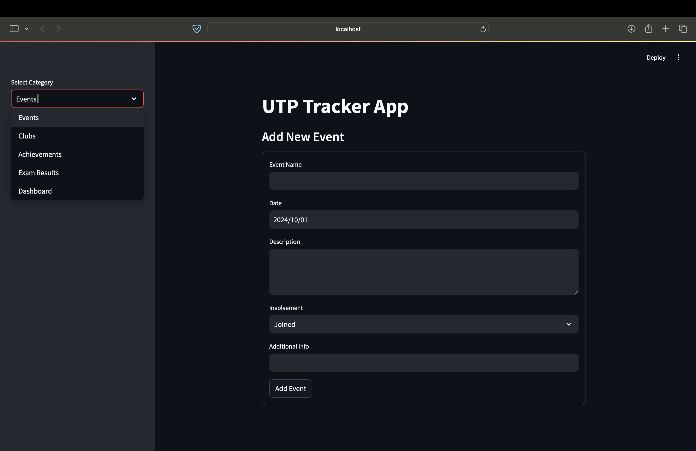
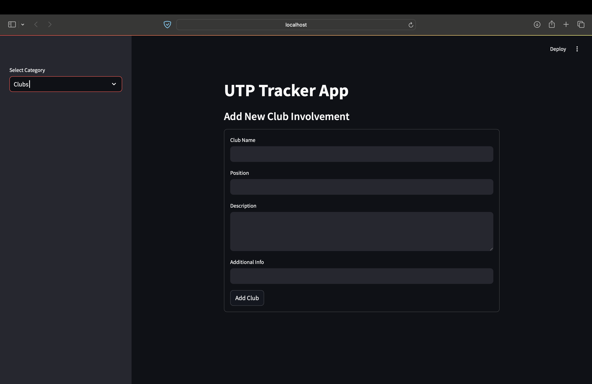
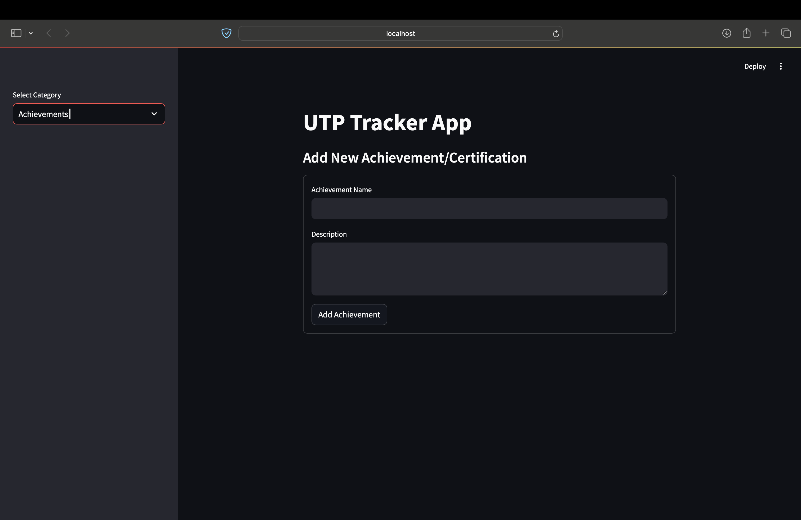
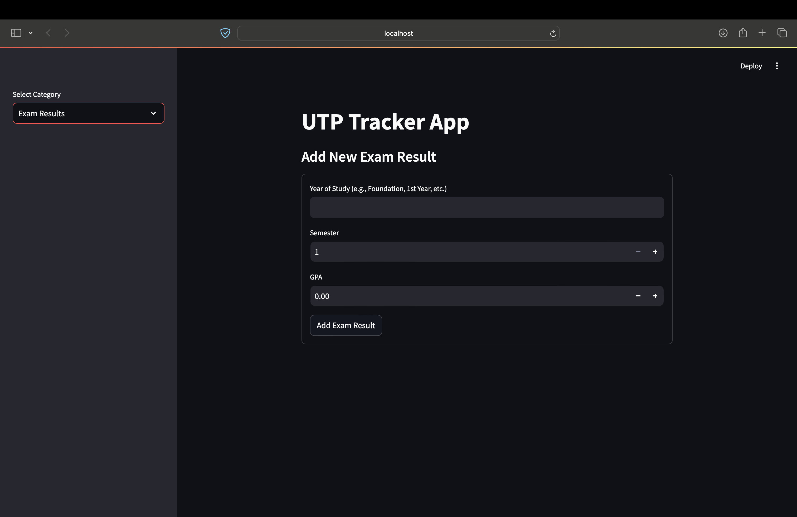
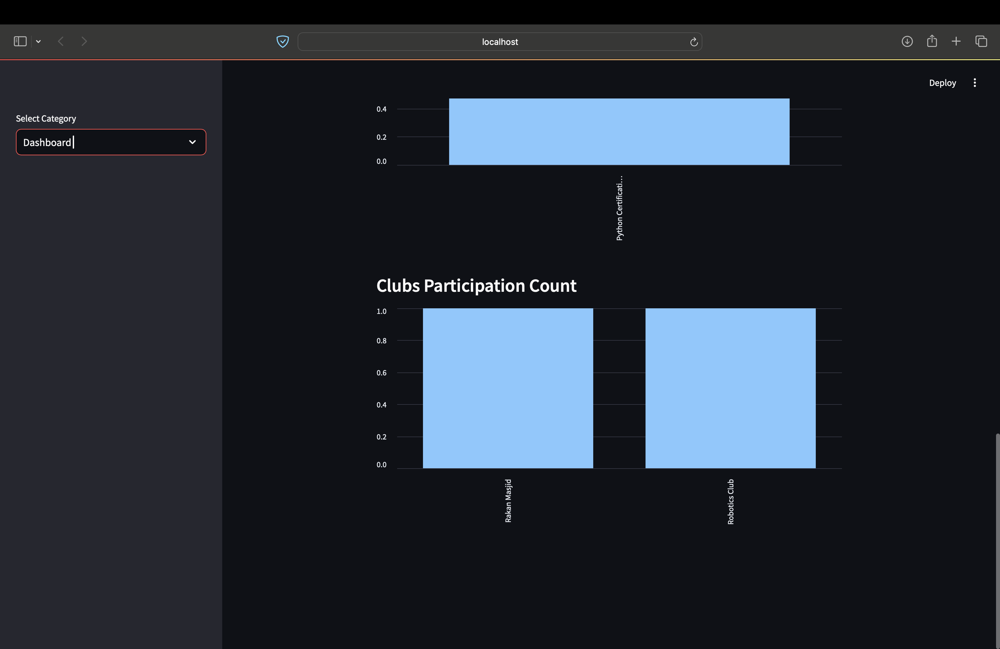
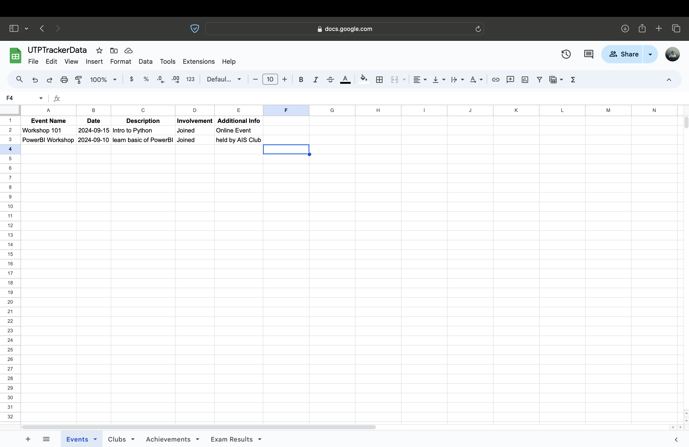

# UTPTrackerApp

## Table of Contents
- [Overview](#overview)
- [Features](#features)
- [Technologies Used](#technologies-used)
- [Setup Instructions](#setup-instructions)
- [Usage](#usage)
- [Lesson Learnt](#what-i-learned-from-doing-this-project)
- [Future Improvements](#future-improvements)
- [Contributing](#contributing)

## Overview
The **UTPTrackerApp** is a web application designed for students of Universiti Teknologi PETRONAS (UTP) to manage and visualize their academic and extracurricular achievements. This app allows users to track events they have joined, organized, or volunteered for, club involvements, certifications, and exam results, all in one place.

<p align="center">
  
</p>

## Features
- **Event Tracking**: Add and manage events you've joined, organized, or volunteered for, including details like name, date, description, involvement, and additional information.
- **Club Involvement**: Record your participation in clubs and societies, including your position, description, and additional info.
- **Achievements/Certifications**: Keep track of your achievements and certifications with descriptions.
- **Exam Results**: Store and visualize your GPA, year of study, and semester results.
- **Data Visualization**: Generate visual representations of your data for better insight into your involvement at UTP.

<p align="center">      </p>

## Technologies Used
- **Python**: Programming language used for the backend.
- **Streamlit**: Framework for building the web application interface.
- **gspread**: Library for accessing Google Sheets.
- **pandas**: Library for data manipulation and analysis.
- **matplotlib**: Library for data visualization.
- **Google Cloud Platform**: For hosting Google Sheets and API management.

## Setup Instructions
1. **Clone the Repository**:
   ```bash
   git clone https://github.com/yourusername/utp-tracker-app.git
   cd utp-tracker-app

2. **Create a Virtual Environment** (optional but recommended):
   ```bash
   python -m venv .venv
   source .venv/bin/activate  # On Windows use .venv\Scripts\activate
   
3. **Install Dependencies**:
   ```bash
   pip install -r requirements.txt
   
4. **Set Up Google Sheets API**:
- Enable the Google Sheets API and Google Drive API in the Google Cloud Console.
- Create credentials (service account) and download the ```credentials.json``` file.
- Share your Google Sheets file with the service account email.

<p align="center">
  
</p>

<p align="center">
  Picture above shows the Googlesheets that I used as a database to store my data.
</p>

5. **Run the Application**:
   ```bash
   streamlit run app.py
   
## Usage

- Open your web browser and go to ```http://localhost:8501``` to access the application.
- Follow the prompts to add, view, and visualize your events, club involvements, achievements, and exam results.

## What I Learned from Doing This Project

- **Google Sheets API**: Learned to use the Google Sheets and Drive APIs to manage data effectively.
- **Data Management**: Gained experience in handling data with Python and integrating it into a web application.
- **Web Development**: Developed skills in creating user-friendly web applications using Streamlit.
- **Data Visualization**: Improved my ability to visualize data to provide insights into user achievements and involvement.

## Future Improvements

- **User Authentication**: Implement user authentication to allow multiple users to securely access and manage their individual data.

- **Enhanced Data Visualization**: Integrate advanced data visualization libraries to create more interactive and insightful dashboards.

- **Mobile Responsiveness**: Optimize the web application for mobile devices to improve accessibility and user experience on different screen sizes.

- **Offline Mode**: Add offline functionality to allow users to view and input data without an internet connection.

- **Expanded Data Categories**: Introduce additional categories for tracking other student activities, such as internships, projects, or community service.

- **Integration with Other Platforms**: Explore integration with other platforms (e.g., LinkedIn) to automatically pull in achievements or event data.

- **Notifications and Reminders**: Implement a notification system to remind users of upcoming events, deadlines, or exam dates.

## Contributing

Contributions are welcome! If you have suggestions for improvements or new features, feel free to create an issue or submit a pull request.


   